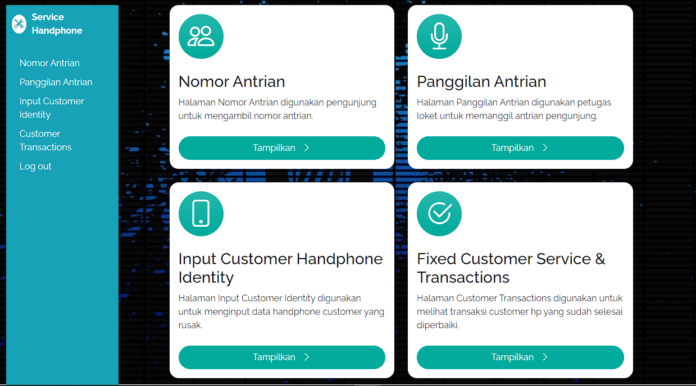

# Aplikasi-Admin-Sistem-Antrian-ServiceHp
Aplikasi Sistem Pengelolaan Antrian Service Hp dengan PHP dan Mysql

Sistem Antrian Service HP untuk Admin adalah aplikasi web yang dirancang khusus untuk memudahkan admin layanan perbaikan HP dalam mengelola antrian dan layanan perbaikan dengan efisien. Dengan tampilan yang sederhana, admin dapat dengan mudah melakukan tugas-tugas berikut:

## Fitur Utama

### 1. Fitur Login Admin
- **Fitur login admin yang simpel, dengan username dan password yang telah ditetapkan melalui file login.php.
Teknologi yang Digunakan

### 2. Pengambilan Antrian dan Pemanggilan Pelanggan:

- Admin dapat mengambil nomor antrian untuk pelanggan secara online.
- Pemanggilan pelanggan berbasis nomor antrian untuk layanan perbaikan.
  
### 3. Input Detail HP Pelanggan:

- Admin dapat memasukkan detail HP pelanggan seperti merek, model, dan deskripsi kerusakan ke dalam sistem.
- Data pelanggan tersimpan dengan aman untuk pengelolaan lanjutan.
  
### 4. Konfirmasi Detail Service & Pembayaran Setelah Perbaikan:

- Admin dapat mengonfirmasi pembayaran setelah layanan perbaikan selesai.
- Proses konfirmasi pembayaran yang mudah dengan tombol "Done" setelah pekerjaan selesai.

 Bahasa Pemrograman: PHP
 Database: MySQL
 Frontend: HTML, CSS, Bootstrap
 ibrary/Tool: jQuery, ResponsiveVoice

 

   
  Gambar 3

sumber Domain Hosting Asli : [www.antriserrvc](http://localhost/Antrian-sistem/www.Antriservicehp.my.id)http://localhost/Antrian-sistem/www.Antriservicehp.my.id
Kondisi : Mati
